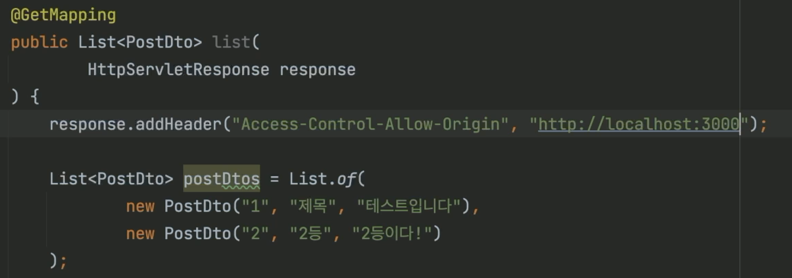
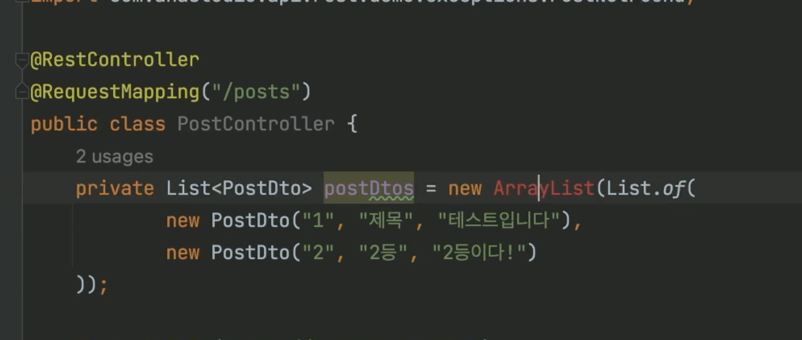
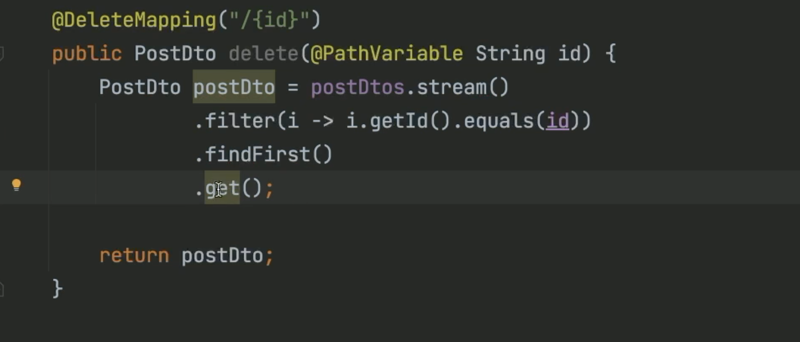
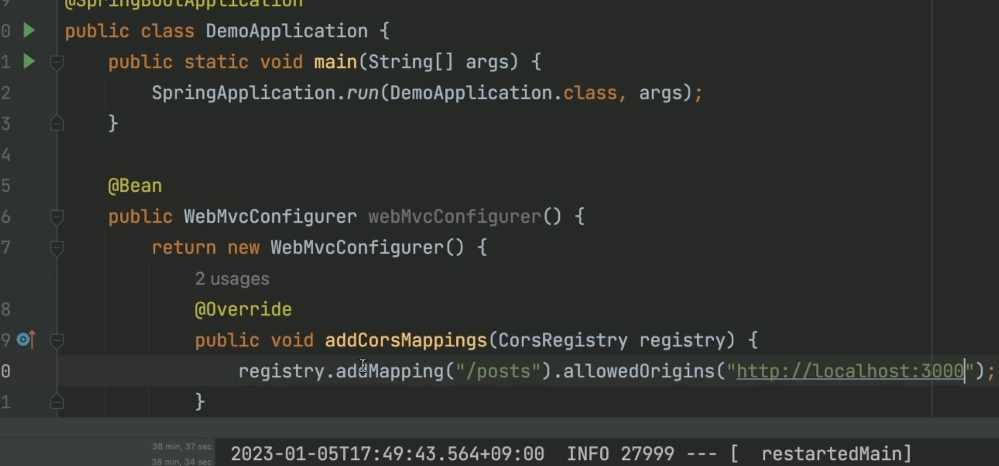
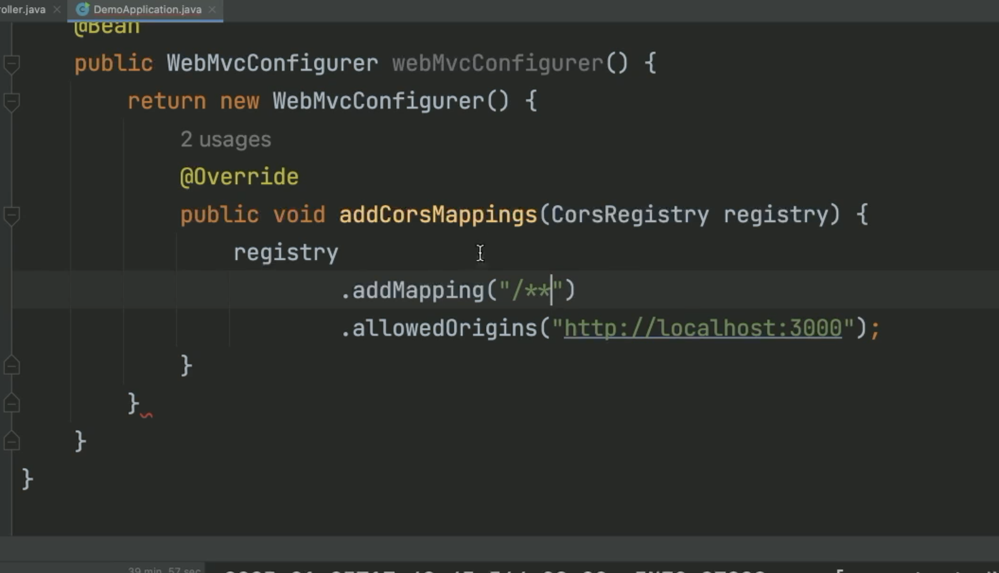
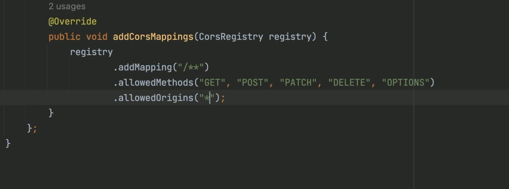

# 키워드
## 학습 키워드

- CORS 란
    - 동일 출처 정책
    - JSONP
    - `Access-Control-Allow-Origin`
- `@CrossOrigin`
# 내용
## 학습 키워드

- CORS 란
    - 동일 출처 정책
    - JSONP
    - `Access-Control-Allow-Origin`
- `@CrossOrigin`
# 필기

서버를 실행하심.
아예 페일드 였는데
아까랑 에러 ㄱ종류가 다름.

SOP
동일 출처 정책
: 웹브라우저가 처리하는 보안 정책.

네트웍에서 다시 보죠
에러를 서버가 낸게 안리ㅏ
Request HEADER
Origin 헤더를  보세요
그게 출처임.

GET /posts HTTP/1.1
host: http://localhost:8080 -> Back-end(REST API)
Origin: http://lolcalhost:3000 -> Front-end

서버에서는 이미 다 처리 끝냄.

자바스크립트에서 저렇게 callback을 넣어줄수도 있다.

아 잘 안되네, CORS도 하자.
여기(F/E)서 요청한거라면 괜찮아요 하는것. 그것이 CORS

거기선 쓰라고 해줘 라고 브라우저에다 알려줄수 있음.

HTTP/1.1 200 OK

Access-Control-Allow-Origin

응답메시지
HTTP/1.1 200 OK
Access-Control-Allow-Origin: https://ahslstudo.com
(빈줄)
[
    {
        "id":"123",
        "title":"재밌는 이야기",
        "content":"다음 기회에"
    }
]

다시 내용을 보면 저렇게 될수가
addHeaer의 위값을 슥삭 조절해주면 잘 된다.
ㅋㅋ
*로 해줄수 있다 ㅋ
서블릿을 깊은 곳에서 
아 좀 마음에 안드네...

방법이 있죠
@CrossOrigin()
스프링에서 이렇게 지정해줄 수 있습니다.

옵션스로 넘기는 것이 있쬬.
반복적으로 해줘야하는 게 많으니까.

다 필요없다. @CrossOrigin 저거 써버리자~~
저걸 써버리고 프론트 업뎃하면
잘되죠
굳.

포스트 매핑하는 쪽에서 싹다 잘 되죠 ㅋ

뭔가 또 잘못되었네요 이런
쭉쭉..

* 데자뷰 오졋다
리스트 오브 써서 이뮤터블한데 수정해서 오류떳었음 ㅋ

이것이 계속 걸리네..
클래스 단에서 @CrossOrigin()해버리시죠.

CORS 다 해결

* 우리가 별 해버리자. 그냥
저 어노테이션안에서 별 넣으면 됨.

* 애플리케이션 전체에 대해서 CORS 쓰고 싶으면
  * WebMvcConfigurer를 쓰면 됩니다~!

Spring Bean -> 스프링에서 관리하는 객체

@Bean
public WebMvcConfig
아무튼 저게 필요합ㅁ니다 ㅋㅋ
그쵸 추천해주죠 ㅋ.

addCorsMappings
regitstry.addMapping();

빌드 굳굳~
또 쓰는 거 또 보죠 삭제도 완전 잘되고 예압 굳.

딜리트에서 허용해줘야하는 데...
빌드 ㅋ 굳
이제 잘되네요.
all

* 이렇게 해줄수도 있죠 굳.
비슷해요 ㅋ
안쓰면은 별이 된다.

## 학습 키워드

- CORS 란
    - 동일 출처 정책
    - JSONP
    - `Access-Control-Allow-Origin`
- `@CrossOrigin`