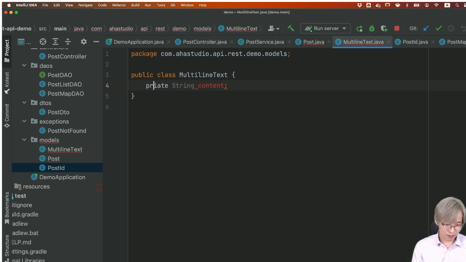
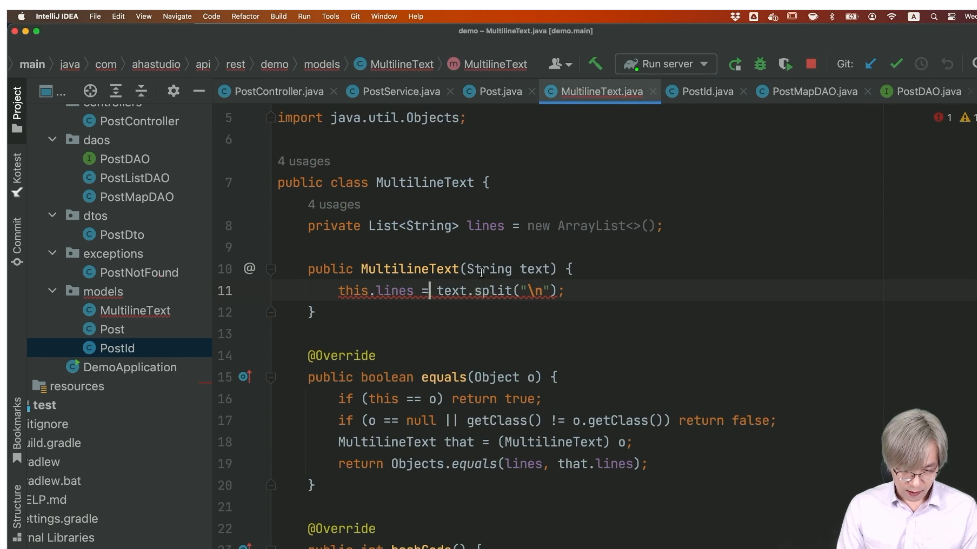
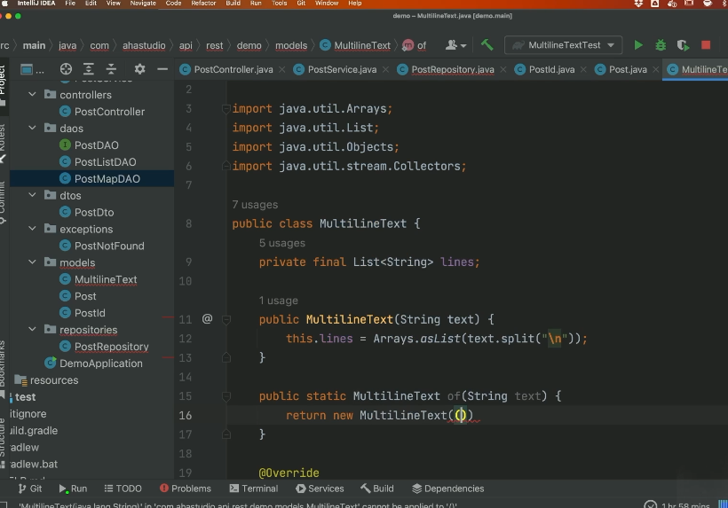
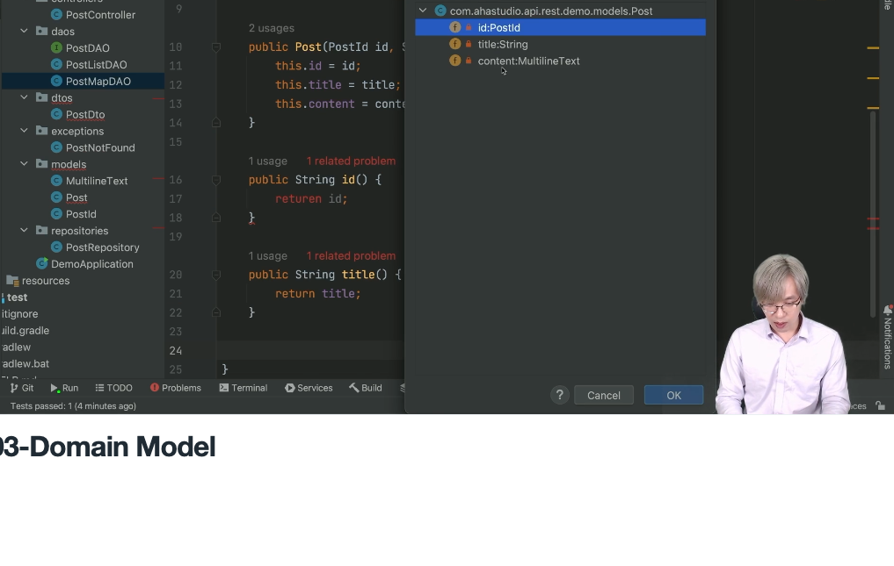
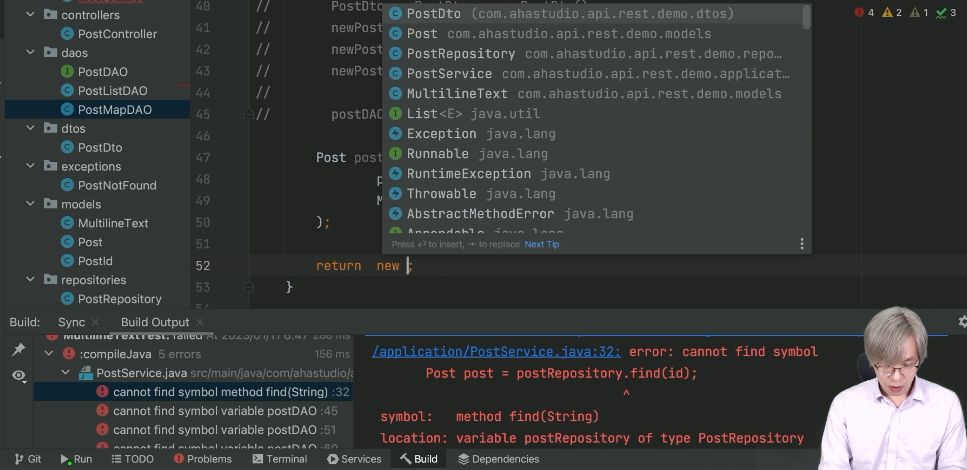

# 키워드

## 학습 키워드

- Domain Model 이란
- Repository
- VO(Value Object)

# 내용

## 학습 키워드

- Domain Model 이란
  - 도메인에서 사용하는 용어를 객체로 나타낸것.
  - 도메인 모델은 지식 영역의 선택된 측면을 설명하는 추상화 시스템이다.
  - 실제 세상에 존재하는 개념들을 소프트웨어 환경에 맞게 적용한 것을 의미한다.
  - 보통은 로우 레벨은 data layer에서 사용되고, 데이터에 대한 접근을 상위 api로 부터 얻는 경우가 많습니다.
  - JPA에서 사용하는 엔티티를 떠올리자!
  - 가장 간단한 개념들! : 연필, 사과, 유저 등..
- Repository
  - domain 과 data mapping layer사이에서 중재하는 역할
  - 러프하게 해석하면 비즈니스 영역과 dbms 사이에서 중재하는 것!
  - jpa의 repository나 DAO가 유사함.
  - 세부적으로 그 차이를 둔다면
    - DAO : 데이터를 관리
    - Repository : 도메인 모델을 다룸.
- VO(Value Object)
  - SI, SM에서 사용하는 DTO 명.
  - 특정한 조건을 만족하는 간단한 엔티티 객체를 의미했다.
  - 두개 객체가 이 식별자가 아닌 값에 의해서 같다고 판단될때, 그것들을 VO라고 한다.
  - 이것은 수정불가능해야한다.

# 필기

## 학습 키워드

- Domain Model 이란
- Repository
- VO(Value Object)
  - 특정한 조건을 만족하는 간단한 엔티티 객체를 의미했다.
  - 두개 객체가 이 식별자가 아닌 값에 의해서 같다고 판단될때, 그것들을 VO라고 한다.
  - 이것은 수정불가능해야한다.

---

## 필기내용.

- 도메인 모델

- 행위없이 코딩.. \* setㅁㅁㅁ만 하는 경우
  (내가 너를 다 파악해서 조작하겠다. 협력아님. 복잡성이 감소하지 않음.)

- 행위가 있다면?

  - account.increatAccount(10_000)

- 그 행위를 믿을수 있게 하기위한 존재 -> unit test

- DAO : 데이터를 관리.
  - DAO는 디비 중심.

* DDD를 빡세게 하는 곳들은 우리가생각은 dto의 필드들도 세세하게 클래스로 만든다.

* 오브젝트 책 소개.
  - DDD나 풍부한 도메인 모델을 다루자.
    책에 다루는 영화예매 프로그램이 있다.
    우리가 만든 도메인 모델은 이렇게 되어 있나?

이때부터는 코드 양이 늘어납니다.(실습이 실제로 그러함.)

- Post

도메인 모델을 쓰고 싶은데..

```java
public class PostId{
private String id;

    // 롬복. equalsAndHasCode라는게 있다.

}
```

## 캡쳐





- 극단형 Domain 쓰는 예시를 진행중

- Go to test 라는 기능이 인텔리제이에 있음.

- 우리는 Post라는 도메인 모델을 풍부하게 다루는 연습을 하고 있다.

레파지토리가서 아래와 같이 정적 팩토리 매서드 만들수 있습니다.
Postid.of("1")


DTO는 set, get이럴수도 있지만
DDD를 위해 이름 따로 잡을 게요.



그 다음 써비스 가서..
Post post = new Post();
타이틀까지
타입을 하나하나 구별한다고 하면 전혀 했갈릴 필요가 없다.

- 이
  this.id = new PostId(TsidCreate..)



// Getter는 절대로 비즈니스 로직을 위해 쓰지 않는다.

- (왜? 이해를 잘 못함.)


- 실습은 여기까지.
  - 쪼금더 깔끔하게 쓸수 없나?
  - 음 가능하다. 스프링 자체에 대해서 좀더 공부해볼게요
