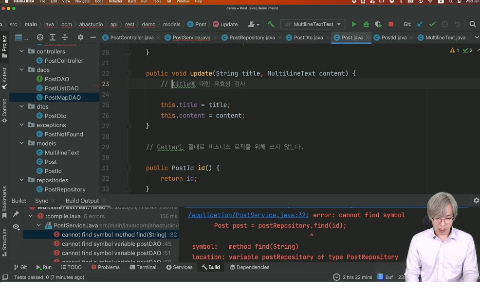

# 키워드
## 학습 키워드

- Domain Model 이란
- Repository
- VO(Value Object)
# 내용
## 학습 키워드

- Domain Model 이란
- Repository
- VO(Value Object)
# 필기

도메인 모델 등..

행위없이 코딩.. setㅁㅁㅁ만 하는 경우
(내가 너를 다 파악해서 조작하겠다. 협력아님. 복잡성이 감소하지 않음.)

행위가 있다면?
account.increatAccount(10_000)

믿을수 있게 하기위한 존재 -> unit test

DAO : 데이터를 관리.
DAO는 디비 중심.

data mapper를 통해서 따다다닥...

DB에는 ireumw

둘이 관련이 없다곤 할순 없겠지만..

여러가지 다른 식으로 처리할 수 있다.
DDD를 빡세게 하는 곳들은... 

어디에 더 무게를 두느냐의 차이가 있다.

DDD나 풍부한 도메인 모델을 다루자.
책에 다룬느 영화예매 프로그램이 있다.
우리가 만든 도메인 모델은 이렇게 되어 있나?

이때부터는 코드 양이 늘어납니다.
Post
ㅋ... 무기력한 도멩니 만드는 중

도메인 모델을 쓰고 싶은데..

public class PostId{
    private String id;

    // 롬복. equalsAndHasCode라는게 있다.
}

## 학습 키워드

- Domain Model 이란
- Repository
- VO(Value Object)

* 극단형 Domain 쓰는 중입니다.

* Go to test

* @Test
void creation(){
    MultilineText multilineText = new MultilineText();
    assertEquals("")
}

* 우리는 Post라는 도메인 모델을 풍부하게 다루는 연습을 하고 있다.

레파지토리 가서.

정적 팩토리 매서드 만들수 있거든여 ㅋ
Postid.of("1")

DTO는 set, get이럴수도 있지만
DDD를 위해 이름 따로 잡을 게요.

그 다음 써비스 가서..
Post post = new Post();
타이틀까지
타입을 하나하나  구별한다고 하면 전혀 했갈릴 필요가 없다.

* 이
this.id = new PostId(TsidCreate..)

* 너무 빠르네 ㅋ..

post.update 해주는 거임 ㅋ
여러분들은 기본이 켜져있으실 거임.

public void update

// Getter는 저대로 비즈니스 로직을 위해 쓰지 않는다.

getter를 절대로 비즈니스 로직을 위해 쓰지 않는다.

띄우면 뜨는걸 볼수 ㅣㅇㅆ죠 ㅋ..

댇ㄴ..

2번을 고쳤는데 2번이 find가 안되었네요 이런 ㅠ

저ㅡ

Post post = posts.get(id)
if (post == null) {
    throw new PostNotFound();
}

PostId.of(..)
이런 내용이 잡히죠.
도메인 모델이 특별하진 않아요 ㅋ.
없이 넣었더니 알아서 해줘 ㅋ.

굳이 dao에다 해줘 이럴 필요도 없다는 것이죠. create 가서 set도 하고 저장하고 그런것들을 잔뜩할거란 말이죠.
그런데서 차이가 있다.

* 쪼금더 깔끔하게 쓸수 없나?
* 음 가능하다. 스프링 자체에 대해서 좀더 공부해볼게요 ㅋ.
