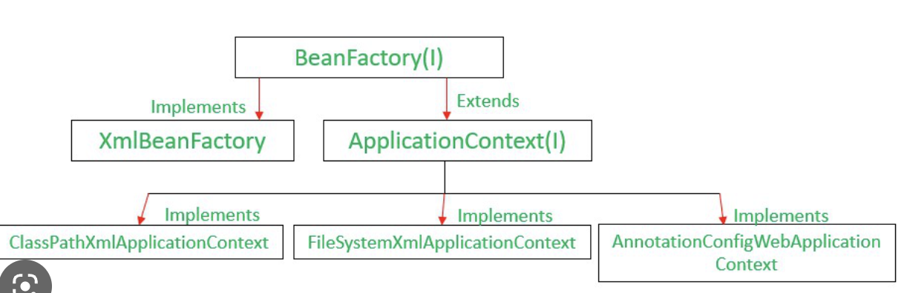

# 키워드

## 학습 키워드

- Spring AOP(Aspect Oriented Programming)
- Dependency Injection
- 싱클턴 패턴
- IoC(Inversion of Control)
- Spring Bean
- BeanFactory

# 내용

## 학습 키워드

- Factory Pattern

  - D : 다른 오브젝트를 만드는 객체를 사용하는 패턴.
  - W : 생성에 대한 책임을 위임할수 있고(SRP관점에서), 경우에 따라 싱글톤하게 객체가 유지되도록 할수 있다.

- Spring AOP(Aspect Oriented Programming)
  - 관점 지향 프로그래밍의 준말.
  - 다른 관점에서 코드를 집어넣는 것을 의미한다.
- Dependency Injection
  - 의존성을 주입한다.
  - 그리고 이러한 주입은... AOP에 의해서 일어난다!(프레임워크가 AOP 역할로)
- IoC

  - D : 프로그래머가 작성한 프로그램이 재사용 라이브러리의 흐름 제어를 받게되는 디자인 패턴.
  - 이유 : 다른 시스템이 어떻게 동작할지에 대해 고민할 필요없이, 미리 정해진 협약대로만 동작하게 하면 된다.

- 싱클턴 패턴
  - D : 특정 인스턴스의 개수를 일정하게 유지하는 것임. 그런 것임.
  - W : 메모리 낭비 방지.
- Spring Bean
  - 스프링이 관리하는 자바 객체를 의미한다.
- BeanFactory
  - 빈을 만드는 팩토리.
  - The root interface for accessing a Spring bean container.
- BeanFactory vs ApplicationContext

  - BF : 스프링 컨테이너 최상위 인터페이스, 스프링 빈을 관리하고 조회. getBean 제공.
  - AC : BF를 상ㅇ속받음. 수많은 부가기능 제공.(국제화, 환경변수, 이벤트, 리소스 조회 등.)
    

- BeanDefinitionRegistry
  - Interface for registries that hold bean definitions, for example RootBeanDefinition and ChildBeanDefinition instances
- DefaultListableBeanFactory
  - BeanDefinitionRegistry을 구현하는 구현체.
- GenericBeanDefinition

  - 표준 빈 정의를 목적으로 한, 원스탑 샵이다.

- BeanFactory 사용 예시.

```java
// 준비하는 부분 → Given, setUp(BeforeEach)

DefaultListableBeanFactory beanFactory = new DefaultListableBeanFactory();

GenericBeanDefinition beanDefinition = new GenericBeanDefinition();

beanDefinition.setBeanClass("postController", PostController.class);

ConstructorArgumentValues constructorArgs = new ConstructorArgumentValues();
constructorArgs.addIndexArgument(objectMapper);

MutablePropertyValues propertyValues = new MutablePropertyValues();
propertyValues.add("objectMapper", objectMapper);

beanFactory.registerBeanDefinition(beanDefinition);

// 사용하는 부분 → When, Then

PostController postController = (PostController) beanFactory.getBean("postController");

PostController postController =
	beanFactory.getBean("postController", PostController.class);

List<PostDto> postDtos = postController.list();

assertThat(postDtos).hasSize(2);
```

- AnnotationConfigApplicationContext
  - ApplicationContext의 구체적 구현체. 아래처럼 쓸수있음.

```java
ApplicationContext context = new AnnotationConfigApplicationContext(AccountConfig.class);
AccountService accountService = context.getBean(AccountService.class);
```

# 필기

- DI에 대한 것을 이야기하겠다.
- 제어 반전.

- 마틴파울러 제어 반전.

- 제어권이 TK로 넘어가는것..

  - 제어의 역전이라고 프레임워크를 정의하는 특징처럼 보인다.

- 헐리우드 원칙이라고들 한다.

- 스프링의 탄생 배경

  - EJB를 비판하면서, light 더 잘 쓸수 있다.(로드 존슨)
  - 결국 디펜던시 인젝션이란 새로운 용어로 쓰임.
  - Ioc DI 혼용해서 쓴다.

- Setter injection

  - 다른데서는 생성자 주입도 많이 한다.

- final 필드로 만들어서 쓰는 것을 굉장히 권장하고 있다.
- 파이널엔 세터가 안된다.

- 스프링이 관리하는 객체를 빈이라고 한다.

  - spring bean이라고 콕 집어서 이야기한다.

- BeforEach로 독립적으로 같이 들어갈 부분을 적용할 수 있습니다.

- 지금 bean definition을 등록하고, 빈을 꺼내고 있다.(29분 40초)

- 생성자 주입.(테스트 코드에 생성자 주입을 슥 해버리는 중...)

- 빈을 주입하는 방법

  - @Configuration @Bean 쓸수도 있고요
    - 자바 컨피기 방식도 있죠.
  - 컴포넌트스캔같은 것을 쓰도록 할수도 있겠죠.

- 스프링 core, 스프링 web mvc

  - 커다란 프로젝트를 만들 수 있게 도움을 주는 것이죠.

- 스프링 코어, spring mvc...너무 너무 강력하죠
- 내부에서 어떻게 돌아가지? 이거에 대한 이해, 특히 중요합니다.
- Infrastructure 외부기술과, application core 핵사고널 아키텍쳐 같은 것을 하나씩 알아보도록 하겠습니다.

## 학습 키워드

- Spring AOP(Aspect Oriented Programming)
- Dependency Injection
- 싱클턴 패턴
- IoC(Inversion of Control)
- Spring Bean
- BeanFactory
