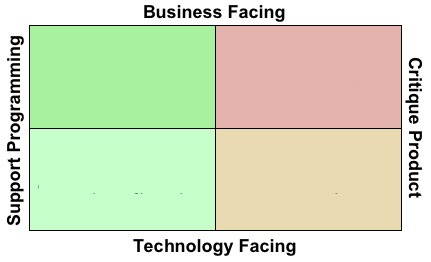
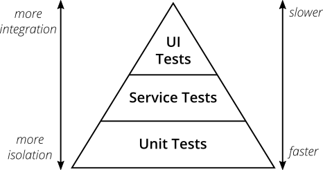

# 키워드

## 학습 키워드

- V 모델
- Test Matrix
- 내적 품질(테스트 코드 작성등)을 높이면 좋은 이유
- JUnit
- 단위 테스트
- E2E 테스트

# 내용

## 학습 키워드

- V 모델

  - 폭포수 모델의 확장된 형태.
  - V모양으로 작업이 이루어지는 것을보고 그렇게 말하는 것임.
  - 구현할때 Top->Bottom으로 작업하고, 테스트할때 bottom-up 으로 테스트된다.
  - 테스트활동을 프로젝트 시작시 함께 함으로써, 그 비용과 시간을 감소시키도록 도움.

- Test Matrix
  
  - 이걸 말하는 것임.
  - 특정한 테스트를 위와 같은 기준으로 분류할수 있다는 이야기임.
- Test Pyramid
  

- 이것을 말함.
- 아샬 왈 : 단위 테스트에 포커싱 하자. 통합을 하고 싶은 마음을 알겠지만, 작은 단위들이 믿을 만하다면, 그것을 조합한 것은 더욱 믿을만해질 것이다.

- 내적 품질(테스트 코드 작성등)을 높이면 좋은 이유
  - 유지보수가 훨씬 쉬워진다.
  - 본능적으로 안심이 된다.
- JUnit
  - 테스트와 관련된 자바 프레임워크.
- 단위 테스트
  - 특정한 단위를 테스트하는 것.
  - ex) 서비스, 레포지토리, 컨트롤러 테스트.
- E2E 테스트
  - End to End test의 약자로, 종단에서, 사용자의 입장에서 테스트를 진행해보는 것이다.
  - 보통 Web, App 등에서 GUI를 통해서 시나리오, 기능 테스트 등을 수행합니다.

# 필기

- 개발 진행을 하다가 요구사항이 불분명한데 이러면 돌아갈수도 있고,
  아무튼 V모델을 쓰기도 한다.
  미리 테스트를 어떻게 할지도 생각을 해야죠.

- 시스템 설계 -> 시스템 사양 결정 -> 시스템 테스트.
  모듈은 여러개가 있죠. 단위테스트를 많이 하죠.
  그리고 구혆을하죠.
  얘네들에 대해서 테스트 관점에서

- Test Matrix라는 것

  - 외부 품질 : 외부의 관점에 보는 것.
  - 내부 품질이 있습니다! : 안을 자세히 보는 것. 안을 까봤는데 이상하다..?

- 테스트라는 것은 하나의 관점으로만 접근하는 것이 아닙니다.
  여러가지를 보죠. 테스트 메트릭스
  왼쪽 아래로 갈수록 내부 품질.
  내가 문제를 바라볼때 어디서 생기는 문제인가?

- 우리가 다루려는 것은 개발자 테스트에 대한 것입니다.
  우리의 한계를 알자 라는 것입니다.
  우리 뭐, 본능적으로 알고 있습니다.
  문제의 원인을 찾기 힘들수도 이죠.
  문제가 생겼을 때 쉽게 원인을 찾고 할수 있겠죠..?
  여기서 가치를 가져야 합니다.
  유지보수를 하기 좋다.

- 도구 자체를 개선하는 도구.
  공장에서 쓰이는 기계 자체를 점점점 좋게 만들 수 있겠죠.

- Unit Test에 대해서 알아보려고 합니다.

XUnit.

- JUnit이 SUnit을 만들었다.
  Unit이라는 말이 들어가지만, 단위테스트만 지원하는 것은 아닙니다.
  전부다 지원합니다.

- 단위 테스트 관점에서 질문을 던져보자.
  Unit : 기계단위, 미터.
  단위들을 생각하자.
  공학적 관점에서는 부품.

  - 하나는 이거 믿고 쓸 수있는 부품인가?
  - 어떻게 검증하고 한발한발 나아갈까?

- 맨처음 몇가지 부품이 있다고 가정하고 코드를 작성함.

```java
public class NewtonThemdTest
    @Test
    @DisplayName("제곱근과 비슷한 값인지 확인하는...")
    void goodEnough(){
        NewtonMethod
    }

    제도 double로 받읍시다~, 아무튼 받읍시다~~!!!
    실행할수도 있겠죠
    !!!
    실행~~ 여기 봅시다~~
    요렇게 해서, false를 기대했는데 True를 줬다~~
    4의 ㅈ곱은 2죠. 아주 명확한거 2개를 준비를 했습니다.
    XunitPatterns

    SUT
    system under test
    NewtonMethod sut = new NewtonMethod();
    private NewtonMethod sut = new NewtonMethod();


    @BeforeEach
    * 뭐하기 전에 이렇게 씁니다.
```

- 자바 독으로 개선점을 표현할 수도 있겠죠

  - gradle run test ing...

- 단순한 유닛 테스트가 제일 많아야해요~~~
  믿을 수 있는 부품들을 잘 하면 되군요 ㅎㅎ..
  부품들이 신뢰할 수 있다면, 조합도 실패할수도있긴함지만
  테스트할때 위로 가려는 충동이 있는데, 내 코드를 재사용해서 써줘, 그 부분을 많이 만들자.

## 학습 키워드

- V 모델
- Test Matrix
- 내적 품질(테스트 코드 작성등)을 높이면 좋은 이유
- JUnit
- 단위 테스트
- E2E 테스트
