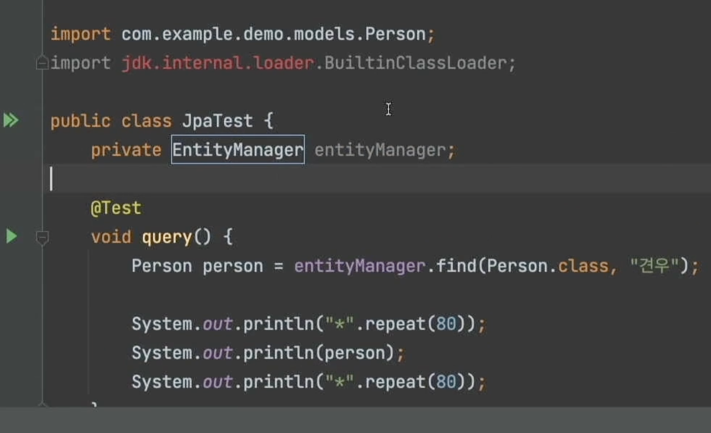

# 키워드

## 학습 키워드

- Hibernate
- 데이터 모델 / 객체 모델
- entityManager
- 트랜잭션
- JPQL

# 내용

- Hibernate
  - jpa 구현체, 거의 표준!
- entityManager
  - 퍼시스턴트 컨택스트와 상호작용하기 위해 사용하는 인터페이스.
  - ex) persist, remove, refresh, etc ...
- 트랜잭션
  - 하나의 논리적 작업 단위를 구성하는 일련의 연산들의 집합을 트랜잭션이라고 한다.
- JPQL
  - Java Persistence Query Language. Jpa 스팩에 명시됨. rdbms에 엔티티를 저장하기 위해 쿼리를 만들려고 주로 사용됨. 하지만, db에 직접 사용되는 언어는 아님.
  - https://www.tutorialspoint.com/jpa/jpa_jpql.htm

# 필기

## 1차시 강의

실습도 할게요~~

JPA 와 관련된 것들을 넣어줄게요~~
그레이들 싱크~~
Item이란 People. 도메인 모델.
Person을 만들어 줍시다.
DB랑 꼭 관련있어야하는 것은 아니지만.. 그렇습니다 ㅎㅎ

- 이번에는 테스트로 해보겠습니다!!
- JpaTest라고 만듭니다!
- EntityManager
  

beforeEach

- entityManager = entityManagerFactory.

@AfterEach
void tearDown

그 팩토리가 널이다.
beforeAll? vs beforeEach
꽤오래걸린다? 좀

아 한번만 실행한다. all은

each는 매번한다.

MATA-INF만들고 써볼게요~!

## 2차시 강의

- test 실행 잘됨.
- 트랜잭션 커밋을 안했었네.
  entityManager.getTransaction();
  transaction.begin();

trasaction.commit();

이미 있어요 에러가 있음 ㅠ

- 단계를 나눠서 보고 싶다!

- 여러개를 얻고 싶다면..?
- JPQL을 쓸수 있습니다~!

- createQuery(jpql, )
  .getResultList();

List<X>
실행을 한번 해봅시다.
queryPeople 얻어지는 것 까지 해볼수 있죠.

Embeddable

- 두가지를 더 알아보겠다.
