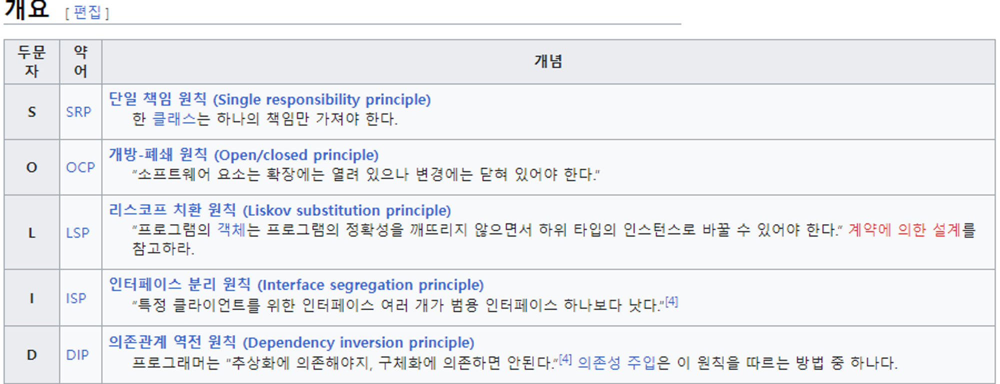
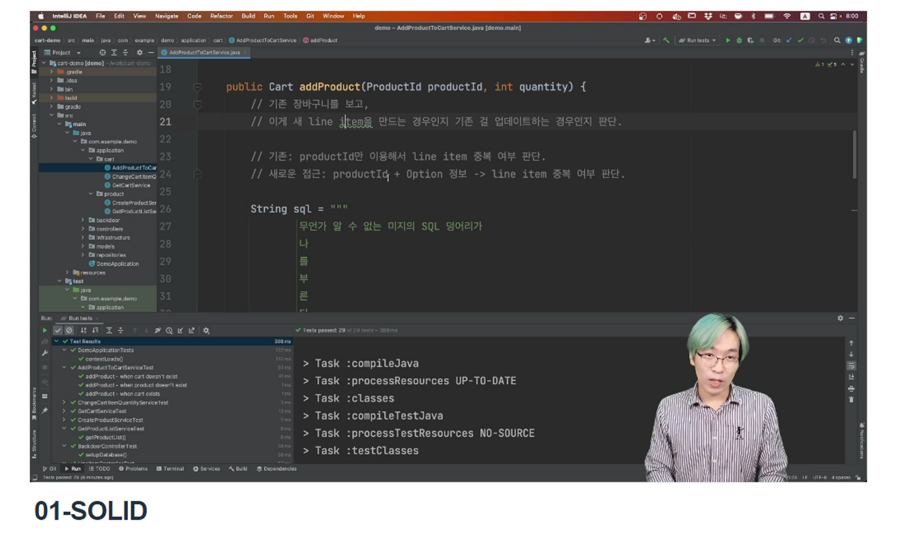
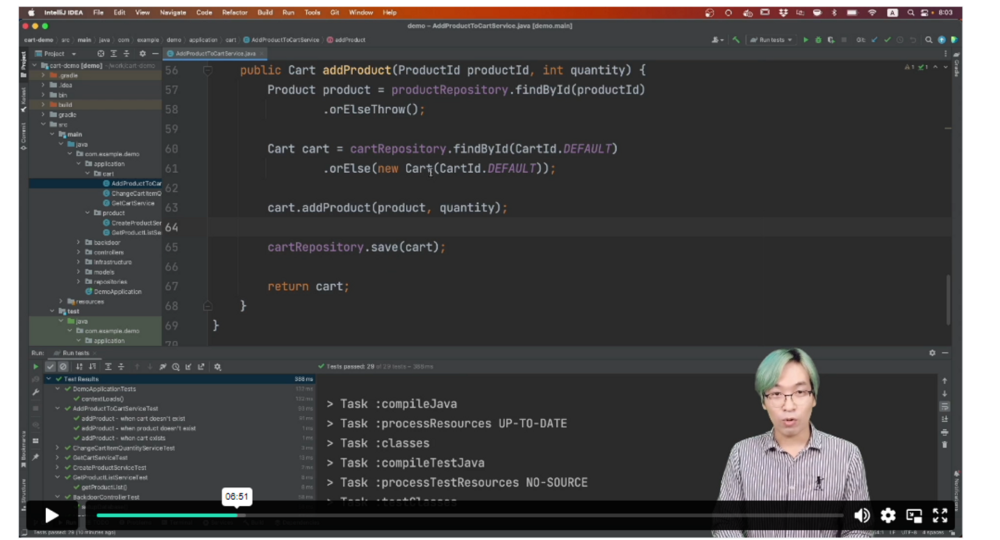

# 키워드

## 학습 키워드

- SOLID (객체 지향 설계)
  - SRP (Single Responsibility Principle, 단일 책임 원칙)
  - OCP (Open-Closed Principle, 개방-폐쇄 원칙)
  - LSP (Liskov Substitution Principle, 리스코프 치환 원칙)
  - ISP (Interface Segregation Principle, 인터페이스 분리 원칙)
  - DIP (Dependency Inversion Principle, 의존관계 역전 원칙)

# 내용

SOLID : 개발시 지켜야할 5가지 객체지향 설계 원칙



LSP를 지키고 있는지 파악하는 방법 중 하나는 상속이 “행위” 측면에서 Is-A 관계인지 파악하는 것이다. 정사각형은 직사각형인가? 우리의 수학적인 직관은 그렇다고 이야기하겠지만, 객체의 행위 측면에서 보면 둘은 엄격히 분리된다. 우리가 올바른 Is-A 관계를 파악하기 위해 “X는 Y인가요?”라고 물을 때 기계적으로 답을 낼 수 없다.

만약 우리가 `ProductService`라는 클래스에 Product와 관련된 기능을 모았다면, 인터페이스만이라도 분리해서 각 기능이 명시적으로 보이게 만들 수도 있다.

```jsx
public interface CreateProductUseCase {
    void createProduct(String name);
}

public interface SearchProductUseCase {
    List<Product> searchByName(String name);
}

public class ProductService
        implements CreateProductUseCase, SearchProductUseCase {
    // …(중략)…
}
```

# 필기

다섯가지 개발 원칙.

원칙, 패턴, 실천 방안들.

## SRP

이거는 SRP 위반이다!

단 한가지 변경 이유만을 가져야 한다.



위에가 결론 적으로는 잘 추상화해서 srp를 지키는 것임

- 테스트 하기도 쉬워지더라..!!!
- 재사용 편해져..!!!

MECE????

8 분 40초까지 완료함. GOOD.

## OCP

- 자바에서는 인터페이스로 정의하더라..!!

## 리스코프 치환 원칙.

- 상속을 받으면 서브 타입이 되지만,
- 진정한 서브 타입은 그 베이스타입 쓰던 자리에 치환이 가능해야한다.
- 상황마다, ...
- ex) 직사각형 클래스를 상속받은 정사각형 클래스. 이상해지더라..!

## ISP

- 코드로 와서, ProductRepository
  List<Product> findAllByName(String name);
  ...

* save
* select는 어떠한가?? 클래스를 나누는 것은 어떠할까?
  - interface SearchProductRepository
  - interface CommandProductRepository

- etc 함수형 인터페이스를 쓸수도 있겠죠.
  - 함수형 인터페이스는 람다식으로 표현이 가능하죠~!

## DIP

- 기술적인것. DB에 의존하지 않아..
- 이미 쓰고 있던것.
- DI. 도메인 객체중에 레포지토리가 있는 것이다.
- DIP는 DI를 쓰면 편합니다.

- 우리가 하고 있는 것이 이런거구나 짚어볼 수있는 시간이 되었음.
