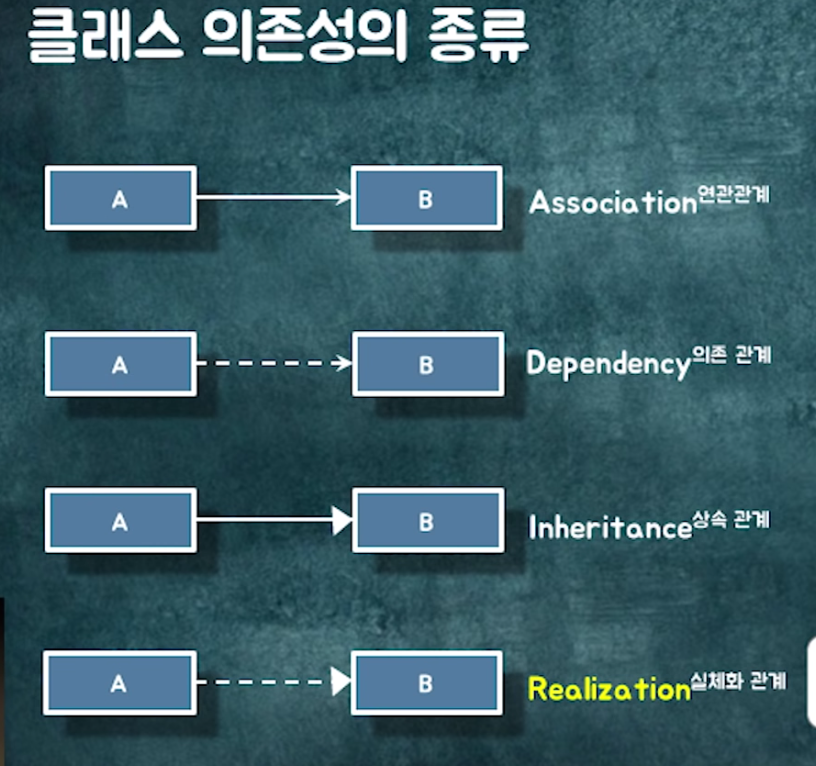

# 키워드

# 내용

- P1 의존성
  - 이런 의존일땐 이렇게 해보는 것이 어떠할까요? 이렇게 제안함.

# 필기

#### P1 의존성에 대해서.

- 의존성을 어떻게 관리하는 게 좋고, 설계는 어떻게 관리하는 게 좋을지 설명하겠다.
- 설계가 뭔가요?
  - 코드를 어떻게 배치할 것인가에 대한 의사결정.
- 핵심 : 변경을 포인트로 설계하면 됩니다.

  - 같이 변경되는 것은 같은 파일, 패키지로..

- 뭐가 되었던, 변경되었을때 나를 이용하는 그녀석도 변경될 가능성이 있어요, 이러면 의존한다고 합니다.

- 클래스 의존성의 종류
  - 연관관계 : 영구적ㅇㅁ,
  - 의존관계. : 일시적으로 딱 맺고 헤어짐.
  - 상속 관계
  - 실체화 관계.
    
- 저 선택을 잘 보세요..

- 좋은 의존성을 위한 몇가지 규칙

  - 양방향 의존성을 피해라.
    - 싱크에서도 버그도 있고, 성능 이슈도 있다.
  - 단방향 연관관계로 바꿔보는 것은 어떠할까?
  - 다중성이 적은 방향
    - Many to one
  - 의존이 필요없으면 제걸해라.
  - 패키지 사이의 의존성 사이클을 제거해라.
