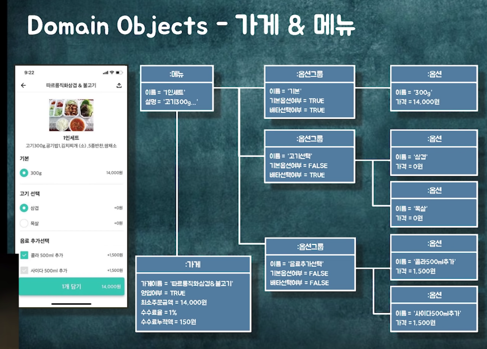
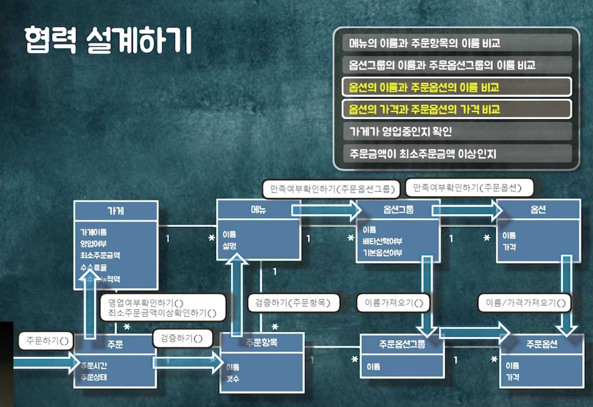
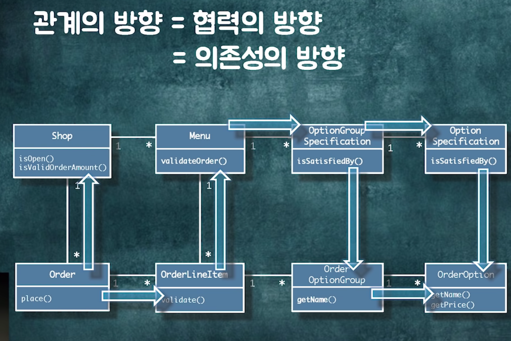

# 키워드

# 내용

- P2 예제

# 필기

#### P2 예제

- P2 시작.
  

- 메뉴 선택과 관련한 문제점

  - 핸드폰 로컬에 장바구니를 저장합니다.
  - 장바구니에 담은 사이에, 사장님이 메뉴를 바꿀수가 있다.
    - 그래서 주문을 할때, 실제로 일치하는 지 검증을 해야합니다.
  - 주문 validation
    - 메뉴 이름, 옵션 그룹 이름, 오셥 이름 과 가격을 검증
    - 가게가 영업 중인지
    - 최소주문 금액 이상인지?
  - 약간 다를 수도.

- 초기 결정된 플로우는 아래와 같다.
  

  - 도메인간에 메시지를 전달하고 있다고 가정하겠다.

- 이 플로우를 이렇게도 저렇게도 바꿔보겠다.

  - 그 장단점을 비교하곘다.

- 클래스 다이어 그램 만들기..

  - 모든 가능성들을 로직이 되었던 움직이지 않는 걸로 만들어 줘야한다.
  - 방향을 결정하는 것이 정말 중요하다.
    

- 관계종류

  - 연관관계
    - 특정한 관계가 영구적으로 필요하겠어..!
  - 의존관계
    - 파라미터로 넘김. 일시적 결정

- 방향성이 중요해요.

  - 참조에는 이유가 필요합니다.
    - 나는 뭐한테 의존해야해 왜냐하면 ㅁㅁㅁ이기 때문이지.

- 개념적인 수준을 구현할 방법이 정말 많다.
  - 1대1 매칭으로 생기는 오해들..
- 우리는 객체 참조를 통해서 연관관계을 구현했다

  - 괜찮은 방법이였을까? 고민해봐야합니다.

- 구현시작하기.
  - 레포지토리를 참고하여 코드랑 현력 관계를 매칭해 주세요.
- 객체 간의 관계를 먼저 만든 다음에 서비스 코드 만들고 레포 만들 것입니다.
