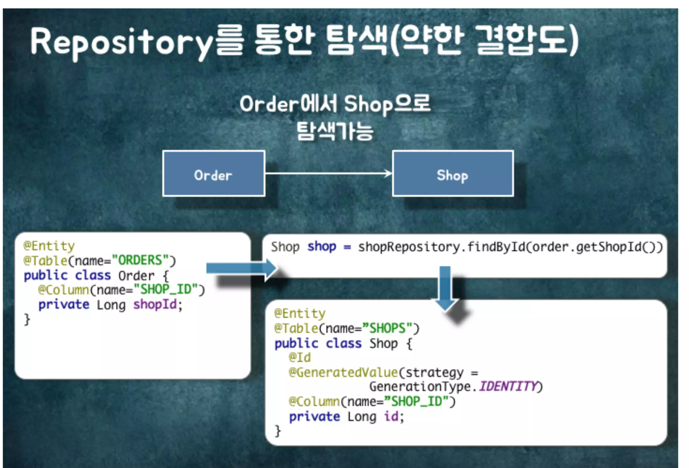
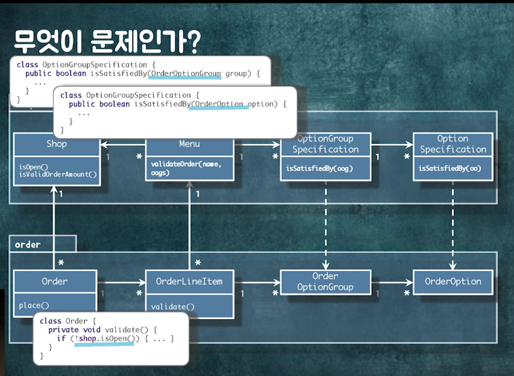
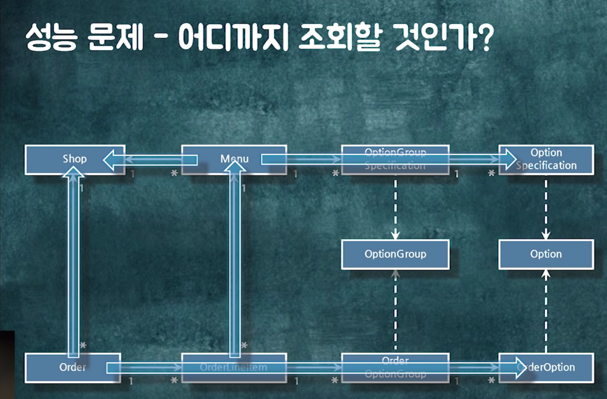
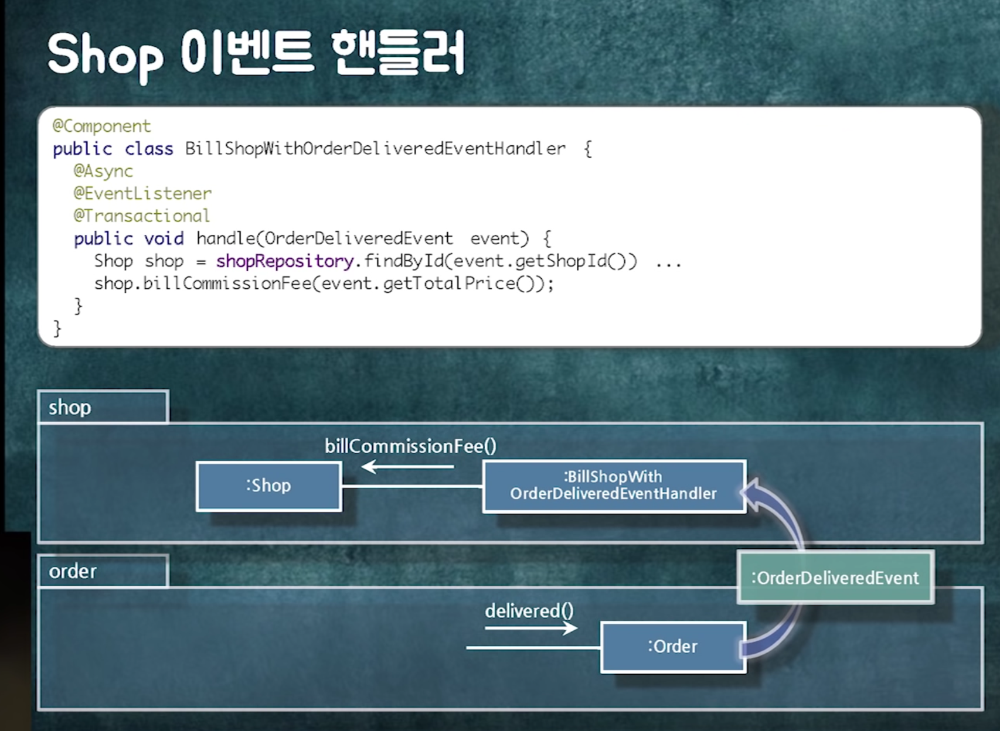

# 키워드

# 내용

- P3 설계 개선하기.

  - 코드 작성 후, 의존성 관점에서 설계를 검토해보자.
  - 객체 참조가 꼭 필요할까? 이부분 다시 생각해보자.
    

  - 객체를 직접 참조하는 로직을 다른 객체로 옮기자!(116PG)

# 필기

#### P3 설계 개선하기(영상 45분 05초 부터, PPT 63부터)

- 객체들이 어떻게 협력을 하고, 그 메서드가 진짜 거기 있어야 하는 게 맞아?
- 설계를 어떻게 개선해야하나요?
  - dependency가 어떻게 되는 지 봐주세요~.
- 디펜던시를 종이에 그려보세요.
  - 약간 이상해, 찝찝해, 그러면 개선 포인트
- 디펜던시를 짜다보면 원하는 방향으로 갈때가 있다.
- 문제 shop과 order사이에 싸이클이 돌더라.
- Shop을 고치면, Order도 고쳐야하는 문제..
  
- 문제 해결 방법3개

  - 중간 객체로 디펜던시 끊기.
    - 조금 이상해 보일순 있죠.
  - 추상화하기.
    - 추상화라는 고정관념. - 인터페이스와 추상클래스여야한다.
      - 이거 정말 고정관념. 구체 클래스일수도 있죠.
  - 패키지 분리하기.

- 디펜던시를 끊음으로써 재사용성이 증가하는 거죠

- 연관관계의 문제: 결합도가 높아짐.

  - 이걸 객체 참조로 해버렸을 때 큰 문제.
  - 다른 객체의 값을 쉽게 참조할수 있다. 이것이 문제다!
  - 헬게이트.
  - lazy loading 이슈, 정말 많다.
    
  - 쿼리가 엄청 길어지고, 조회경계가 모호해집니다.(트랜잭션도 상당히 길어질 소지가 있음.)

- 아무튼 근본 문제

  - 다 연결 되어 있다는 것.

- 하나의 트랜잭션으로 확 가버린다.
- 트랜잭션 경계는 어디까지 인가?
  - 저 객체를 같이 읽거나 수정하고 싶은데..
- 비즈니스 로직이 추가될수록, 트랜잭션이 점점 길어짐..

  - 어떤 테이블에서 어떤 테이블 까지 잠금을 설정할 것인가?

- 로직을 보자.

  - 결제 완료
    - order pay
    - Delivery.Started
      - new Delivery
  - 배달 완료
    - 오더를 찾아서, 배달 완료되었다고 한다.
      - 수수료를 뭔가 계산하는 로직
    - 배달도 다 끝났다고 바꾸자.

- 이것들은 하나의 트랜잭션으로 묶여있음

  - 변경의 빈도가 다르다
  - 롱 트랜잭션으로 묶여있는 것들이 트랜잭션이 묶이는 정도가 다르다
    - 다 락이 걸렸었다. 실제로 이런 경우가 빈번함.
    - 트랜잭션 경합으로 인한 성능 저하

- 객체 참조는 정말 문제다. 어떤 객체라도 접근 이런 문제..

  - 필요한 경우는 객체 참조를 끊자.

- 결합도를 낮추기 위한 방법 - 레포지토리를 통한 탐색.

- 조회나 어드민 로직 때문에 양방향이 막 쓰이더라.. 단방향으로 충분한데

- 같이 변경되는 것들을 묶어라(트랜잭션도 같이)

  - 같이 생성 또는 제거.

- 객체를 묶었어 보는 것은 어떠할까?

  - 경계 안의 객체는 참조를 이용해 접근
  - 그룹 끼리는? -> 아이디를 통해 탐색할 수 있다.
  - ID로만 외부에 노출을 하자!
  - 이렇게 하면 그룹단위의 저장소 변경도 가능해진다!

- 묶더니 컴파일 에러

  - Order Validation을 만들고, 컴파일 에러 나는 것 다 옮기기

- 때로는 절차지향이 객체지향보다 좋다!

- 의존성을 그려보자!

- 도메인 이벤트 퍼블리싱

- 도메인 단위 분리시 의존성 사이클 존재

  - 패키지로 더 나눠본다!

- 3번째 예시, 도메인 상위 그룹이고 그 아래 layer 가 있다.
  - 비동기 메시징 처리도 가능해지더라.
