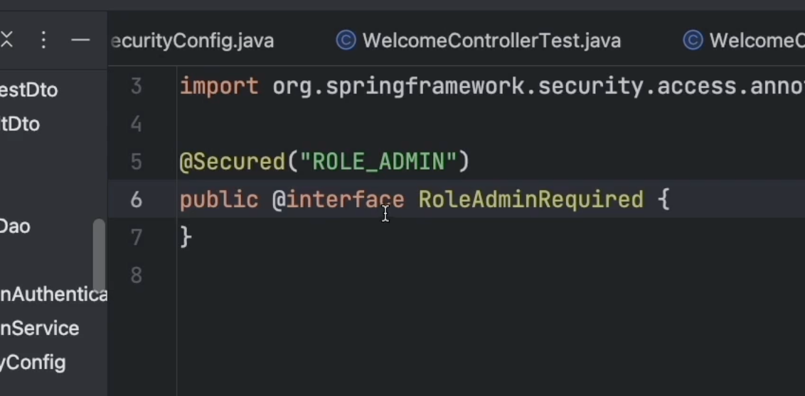

# 키워드

## 학습 키워드

- JWT
- Claims-based identity
- 대칭키 암호화 / 공개키 암호화
- `@Secured`

# 내용

- JWT
  - Json Web Token
  - JSON 웹 토큰은 두 당사자 간에 클레임을 안전하게 표현하기 위한 개방형 업계 표준 RFC 7519 방식임.
  - 헤더, 페이로드, 서명 3단 구성을 가짐.
- ## Claims-based identity
  - 클레임 기반 ID는 애플리케이션이 조직 내부, 다른 조직 및 인터넷에 있는 사용자에 대해 필요한 식별 정보를 획득하는 일반적인 방법임.
  - JSON 웹 토큰(JWT) 클레임은 주제에 대해 주장되는 정보의 일부입니다.
- 대칭키 암호화 / 공개키 암호화
  - 대칭키암호화 :일반 텍스트의 암호화와 암호 텍스트의 암호 해독에 모두 동일한 암호화 키를 사용하는 암호화 알고리즘입니다.
  - 공개키 암호화 : 암호화할때키는 공개키를 사용하고, 복호화할때는 개인키를 사용하는 알고리즘
- `@Secured`
  - 서비스 계층 보안 특성을 설명하기 위한 Java 5 주석입니다.
  - 보안 주석은 비즈니스 메서드에 대한 보안 구성 특성 목록을 정의하는 데 사용됩니다.
  - EnableMethodSecurity 사용해야 이용 가능.

# 필기

## jwt

- auth0에서 제공하는 라이브러리중, 저걸 쓰려고요!
- 우리는 대칭키 암호화 방식을 사용햡니다.
- 비대칭키 암호화 방식을 사용하면 더 보안적으로 높을 것이에요.
- 암호는 적지 마세요. 실행시에 넣어줄 수 있습니다.
  - JWT=2325 ./gradlew bootRun

## Authority

- @Secured 쓰면 끝난다!!
- 유저가 접근했을 때 됨.
- 이렇게 커스텀 어노테이션을 적용할 수도 있음.
  
- 아주 강력히 추천
- 커스텀 어노테이션을 만들어서 쓰는 것을 추천합니다.
