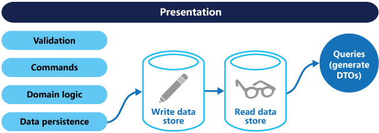

# 키워드

## 학습 키워드

- CQS
- CQRS
- SSOT(Single Source Of Truth)
- Materialized View
- OLTP(Online Transaction Processing)
- OLAP(Online Analytical Processing)
- Event Sourcing

# 내용

- CQS

  - Command Query Seperation
    - 메서드를 2가지 종류로 분류하는 것.
    - 이것을 이렇게 잘 분리하는 것은 적극적인 SRP라고 할 수 있다.
    - Command : 상태를 얻고, 상태를 돌려주지 않음.
    - Query : 상태를 변경하지 않고 상태를 얻음.

- CQRS
  - Command Query Responsibility Segregation
    - 데이터 저장소에 대한 읽기 및 업데이트 작업을 구분하는 패턴.
    - 애플리케이션에서 이거 쓰면, 성능, 확장성, 보안을 최대화 가능함.
      
  - 이 패턴에서 이벤트 소싱 패턴이 같이 사용되는 경우가 많음.
  - 언제 써야할까?
    - 읽기수가 쓰기 수보다 훨씬 큰경우 성능 향상을 위해
  - 언제는 안써도 될까?
    - 도메인이 간단, 비즈니스가 간단
    - 데이터 엑세스 작업이 성능상 크게 이슈 없고, 없을 예정일때
  - https://learn.microsoft.com/ko-kr/azure/architecture/patterns/cqrs
- SSOT
  - Single Source Of Truth
  - 단일 진실 공급원
    - 정보와 스키마를 하나의 출처에서만 생성 또는 편집하는 방법론
    - 데이터의 정합성을 지키고, 잘못된 데이터 유통을 방지가능.
  - https://www.lesstif.com/software-engineering/ssot-single-source-of-truth-128122887.html
- Materialized View
  - 쿼리의 결과를 담고 있는 데이터베이스 오브젝트.
  - 효율적 쿼리와 데이터 추출을 지원함. 애플리케이션 성능 개선에 도움줄 수 있음.
- OLTP
  - Online Transaction Processing
    - 온라인 뱅킹, 쇼핑 등 동시에 발생하는 다수의 트랜잭션을 실행하는 데이터 처리 유형
    - 빠른 응답시간이 필요.
- OLAP
  - Online Analytical Processing
  - 사용자가 동일한 데이터를 여러 기준을 이용하는 다양한 방식으로 바라보면서 다차원 데이터 분석을 할 수 있도록 도와준다.
- 둘의 차이?
  - OLTP : 주로 단순한 쿼리. 빠른 응답시간 필요
  - OLAP : 주로 복잡한 쿼리. 상대적으로 느린 응답시간 요구됨.
- Event Sourcing
  - 특징
    - 데이터의 현재 상태만 도메인에 저장하는 대신 추가 전용 저장소를 사용하여 해당 데이터에 수행된 전체 작업을 기록합니다.
    - 데이터의 알관성을 유지할 수 있음.
    - 보정 작업에 사용하는 전체 감사 추적 및 기록을 유지할 수 있음.
    - CQRS와 연결되어 사용됨.
  - 언제 유용할까?
    - 변경 내역 추적시
    - 업데이트 충돌 발생을 최소화하기 위해
    - 시스템 상태 롤백이나 변경 내용 복원시.

# 필기

- CQS
  - 상태를 바꾸는 것, 검색하는 것 으로 나눈것.
  - 메서드의 성격에 따라 두종류로 분리하자는 이야기.
    - 바꾸는것
    - 바꾸지 않고, 읽기만 하는 것.
  - 분리가 안되는 예시.
    - stack pop. 상태가 바뀌면서 결과가 있음.
- cqrs document
  - remote 퍼사드
    - 컨트롤러, dto가 연결됨.
- 우리가 배운것, 써야하는 순간을 알자.
