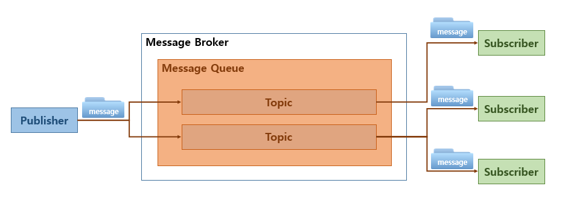

# 키워드

## 학습 키워드

- Redis
- in-memory
- NoSQL

# 내용

- Redis

  - 오픈 소스임. 인메모리 데이터 스토어임.
    - database, 캐시, 스트림 엔진, 메세지 브로커로도 쓸 수 있다.
    - message broker
      
      - Message Broker(메시지 브로커)는 Publisher(송신자)로부터 전달받은 메시지를 Subscriber(수신자)로 전달해주는 중간 역할이며 응용 소프트웨어 간에 메시지를 교환할 수 있게 한다. 이 때 메시지가 적재되는 공간을 Message Queue(메세지 큐)라고 하며 메시지의 그룹을 Topic(토픽)이라고 한다

- in-memory
  - 메모리를 이용한다는 것. 그래서 속도가 빠르다. 하지만, 메모리 특성상, 저장 공간이 2차 저장공간보다 작다.
- NoSQL
  - 다양한 해석이 있지만, Not Only SQL 이라고 볼수도 있음.
  - 관계형 데이터베이스에서 사용되는 테이블 관계 이외의 방식으로 모델링된 데이터의 저장 및 검색을 위한 메커니즘을 제공합니다.

# 필기

- Redis

  - 데이터 베이스 처럼도 쓰고, 캐시로도, 매시징 브로커로도 쓴다.

  - 인메모리 디비
    - 굉장히 빠르다
    - 데이터 스트럭쳐
  - 우리 하려는 거? CQRS 할려고 씁니다.
  - 우리는 데이터 베이스, 캐시의 용도로 쓸거임.

- 코드 참고하자.

  - 도커로 실행..~~

- 우린 새로 만들거
  - web
  - dev tools
  - spring data redis
- redis Config 적용.
- 장바구니를 업데이트 할때 마다 ,dto를 만들어 주자?
- 레디스 해쉬 어노테이션은 키값 구성을 위해 사용 아이디와 같이 사용.

- 선택하는 것.
