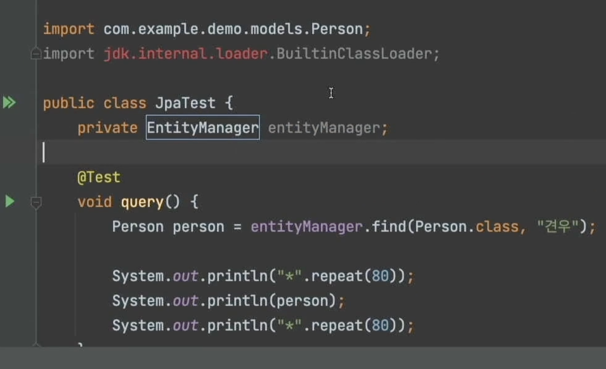

# 필기.

페이지네이션을 한다.
오라클을 한다 이러면 다르게 처리하기도 한다.
SQL 도 같이 고쳐줘야하는 귀찮음도 있잖아요?
유지보수도 좀더 쉬워지고, 좀더 쉽게 할수 있죠.

자카르타 영속화 API
etc..
Jakarta Persistent API
엔터프라이즈 에디션
자바 자체는 오라클이 가지고 있는 상표권이죠.
자카르타.

Java에서 사용하는 ORM 표준이다.
하이버네이트가 정말 유명한 구현체가 된 것이죠.
* 특정 회사 제품이거든여.
* 기능도 많이 있고 ,하이버네이트를 쓰게 될 것입니다.
* 전자에만 집중하면.. 망한다!
* 비즈니스 엔티티 라 했지만, 아닌거죠!

## 학습 키워드

- ORM
- JPA(Jakarta Persistence API)
- Jakarta EE
- Entity

# 02강 - 하이버네이트
실습도 할게요~~

JPA 와 관련된 것들을 넣어줄게요~~
그레이들 싱크~~
Item이란 People. 도메인 모델.
Person을 만들어 줍시다.
DB랑 꼭 관련있어야하는 것은 아니지만.. 그렇습니다 ㅎㅎ

* 이번에는 테스트로 해보겠습니다!!
* JpaTest라고 만듭니다!
* EntityManager

beforeEach
* entityManager = entityManagerFactory.

@AfterEach
void tearDown

그 팩토리가 널이다. 
beforeAll? vs beforeEach
꽤오래걸린다?  좀

아 한번만 실행한다. all은

each는 매번한다.

MATA-INF만들고 써볼게요~!
